# How Complexity Theory Relates to AI Agents

> *"The gap between verification and creation persists. Maybe that's okay. Maybe it's even essential."*

## 🌌 Overview

This repository explores a fundamental question that shapes every aspect of computation, from quantum mechanics to your daily debugging: **Can recognizing correctness give us the power to create it?**

We examine this through multiple lenses—quantum physics, algorithmic information theory, and practical engineering—revealing why the verification-generation gap exists and what it means for AI agents, automation, and human creativity.

```python
IF can_verify_quickly(solution):
    can_find_quickly(solution)?  # Probably not (P ≠ NP)
```

---

## 📚 Complete Wiki Contents

Our comprehensive wiki explores this question through six interconnected perspectives:

### 🔵 **The Quantum Lens**

#### [1. Quantum Mechanics Primer for Software Engineers](../../wiki/Quantum-Mechanics-Primer)
**Start here for foundations.** Understand superposition, entanglement, observer effects, and quantum tunneling through programming analogies and software engineering scenarios.

**Key concepts:** Wave functions as possibility spaces, measurement collapse, quantum debugging patterns, Heisenberg uncertainty as computational constraints.

#### [2. The Observer Effect: How Attempting Solutions Collapses Problem Space](../../wiki/The-Observer-Effect)
Discover how the act of solving changes the problem itself. Every debugging session, every architectural decision, every line of code written collapses infinite possibilities into a single reality.

**Key insight:** *Observation collapses possibilities. In quantum systems, in problem-solving, in code. Choose your measurements wisely.*

### 🟢 **The Algorithmic Lens**

#### [3. Kolmogorov Complexity and Solomonoff Induction: The Algorithmic Lens on P vs NP](../../wiki/Kolmogorov-Complexity-and-Solomonoff-Induction:-The-Algorithmic-Lens-on-P-vs-NP)
**NEW: Mathematical foundations.** Explore why the optimal learning strategy is provably uncomputable, and how K-complexity reveals the fundamental description-discovery gap.

**Key concepts:** Uncomputable compression, Solomonoff's impossible learner, Levin's universal search, the P≠NP argument from information theory, AI agent limitations.

**Sections covered:**
- 📦 Kolmogorov Complexity: The ultimate compression
- 🧠 Solomonoff Induction: The perfect (impossible) learner
- 🌉 The bridge from information to computation
- 🎯 Why P probably ≠ NP (the core argument)
- 🤖 Why AI agents can't achieve Solomonoff optimality
- 🔗 The unified picture across all domains

### 🛠️ **The Practice Lens**

#### [4. Practical Software Engineering Use Cases](../../wiki/Practical-Software-Engineering-Use-Cases)
Real-world applications across CI/CD, Terraform, code review, incident response, and AI-assisted development. See the verification-generation gap in your daily work.

**Examples:**
- ✅ Code review (fast) vs ❌ Writing elegant code (hard)
- ✅ Bug recognition (instant) vs ❌ Bug discovery (hours)
- ✅ Architecture evaluation (quick) vs ❌ Architecture creation (weeks)

#### [5. Kolmogorov-Solomonoff: Practical Implications for Engineering](../../wiki/Kolmogorov-Solomonoff:-Practical-Implications-for-Engineering)
**NEW: From theory to practice.** How K-complexity insights guide real engineering decisions. Decision frameworks for automation boundaries, AI agent design patterns, and understanding the human-AI collaboration frontier.

**Topics covered:**
- 💼 Automation limits and tool selection frameworks
- ⚖️ Honest assessment: Is this a proof? (No, but compelling)
- 🔮 10 open research questions (theoretical to practical)
- 🎭 The big picture: Synthesizing all perspectives
- 📚 Curated resources for going deeper

### 🤖 **The Agent Design Lens**

#### [6. Quantum Mechanics and Stateful vs Stateless Agentic AI](../../wiki/Quantum-Stateful-Stateless-AI)
Cutting-edge exploration of how quantum principles shape AI agent architectures. Understand when to maintain coherent state evolution versus fresh measurements.

**Agent patterns:**
- **Stateless = Quantum Measurements:** Each request independent, infinite scaling
- **Stateful = Coherent Evolution:** Context across time, complex understanding
- **Hybrid = Controlled Decoherence:** Strategic memory management

---

## 🔬 Four Lenses, One Truth

### The Unified Insight

```mermaid
flowchart TD
    A[Central Question] --> B[Quantum Physics]
    A --> C[Information Theory]
    A --> D[Complexity Theory]
    A --> E[Engineering Practice]
    
    B --> F[Measurement collapses superposition]
    C --> G[K-complexity is uncomputable]
    D --> H[Verification ≠ Finding]
    E --> I[Review ≠ Writing]
    
    F --> J[Verification ≠ Generation]
    G --> J
    H --> J
    I --> J
    
    J --> K[The Gap is Fundamental]
```



### Computational Complexity Classes

| Class | Definition | Example | Quantum Analogy | K-Complexity View |
|-------|------------|---------|-----------------|-------------------|
| **P** | Solvable in polynomial time | Sorting, searching | Classical measurement | Decompression (running program) |
| **NP** | Verifiable in polynomial time | TSP, SAT | Superposition of solutions | Verification (checking answer) |
| **BQP** | Quantum polynomial time | Factoring (Shor) | Quantum interference | ? (open question) |

**Current Understanding:** P ⊆ BQP ⊆ NP (probably) and P ≠ NP (probably)

### The Gap Appears Everywhere

```python
# Classical Computing: Sequential exploration
for path in possible_paths:
    if is_solution(path):
        return path  # Exponential time

# Quantum Computing: Parallel superposition  
all_paths = create_superposition(possible_paths)
amplify_correct_paths(all_paths)
return measure(all_paths)  # Still collapses to one solution

# Kolmogorov Complexity: Uncomputable
def find_shortest_program(output):
    # This function CANNOT exist
    # Would solve the Halting Problem
    raise UncomputabilityError()

# But verification is always easy:
def verify_program(program, expected_output):
    return run(program) == expected_output  # Fast!
```

---

## 🎯 Key Insights Across All Pages

### 1. The Observer Effect in Problem Solving

```
Unsolved Problem → [ATTEMPT SOLUTION] → Collapsed Solution Space
       ↓                                         ↓
Multiple paths possible                   Single path chosen
   (Superposition)                         (Measurement)
```

**Implication:** You can't explore all possibilities without committing to one. Every line of code written is a measurement that collapses alternatives.

### 2. Why AI Can't Achieve Perfection

**Solomonoff Induction = Optimal Learning**
- Theoretically optimal for all computable environments
- Assigns probability based on K-complexity (Occam's Razor formalized)
- **Provably uncomputable** - cannot be implemented even approximately

**Therefore:**
- No agent can be universally optimal
- All intelligence is bounded intelligence
- Inductive biases are mandatory, not optional
- Approximation is fundamental, not a limitation

### 3. The Hierarchy of Impossibility

```
UNCOMPUTABILITY (Fundamental)
    ↓
K(x), Solomonoff uncomputable
    ↓
INTRACTABILITY (Practical)
    ↓
P ≠ NP (probably)
    ↓
VERIFICATION ≠ GENERATION (Daily)
    ↓
Code review ≠ Code writing
Bug recognition ≠ Bug discovery
Architecture evaluation ≠ Architecture creation
```

### 4. Agent Architecture Principles

**From Quantum Mechanics:**
- Stateless = Measurement (no coherence, infinite scaling)
- Stateful = Wave function evolution (builds understanding)

**From K-Complexity:**
- Memory = Compressed history
- Good agents compress efficiently but stay within computational bounds
- Bounded rationality isn't a bug—it's reality

**Design Pattern:**
```python
class BoundedOptimalAgent:
    """Best possible given computational constraints"""
    
    def __init__(self, time_budget, memory_budget):
        self.constraints = (time_budget, memory_budget)
        # Approximate Solomonoff within bounds
        
    def learn(self, data):
        # Can't find optimal compression (uncomputable)
        # But can find good-enough compression (tractable)
        return approximate_compression(data, self.constraints)
```

---

## 💡 Why This Matters

### For Software Engineers
- **Understand** why code review is easier than code writing (not incompetence—it's mathematics)
- **Recognize** patterns in debugging and system design
- **Appreciate** theoretical limits of automation
- **Document** your compression discoveries (refactorings are valuable knowledge)

### For DevOps Engineers  
- **Terraform patterns:** Low K-complexity (loops) vs high K-complexity (repetition)
- **CI/CD:** Verification can be automated, generation requires creativity
- **Infrastructure:** State management mirrors quantum measurement vs evolution
- **Tool selection:** Use the gap metric to decide when to automate

### For AI/ML Practitioners
- **Design** better agent architectures grounded in theory
- **Understand** what AI can and cannot do (bounded by K-complexity)
- **Bridge** pattern recognition (easy) and creative generation (hard)
- **Build** human-in-the-loop systems acknowledging fundamental limits

### For Technology Leaders
- **Make informed decisions** about tool capabilities and limitations
- **Understand** the human-AI collaboration boundary is fundamental, not temporary
- **Prepare** for quantum computing integration (changes scale, not existence of gap)
- **Invest** strategically in human creativity vs AI pattern recognition

---

## 🚀 Practical Applications

This exploration has direct applications in:

### DevOps & Infrastructure
- **Terraform optimization:** Recognize when infrastructure has low K-complexity (use modules!)
- **CI/CD design:** Automate verification, preserve human creativity for architecture
- **Incident response:** Pattern matching (AI-assisted) vs root cause discovery (human-led)

### System Architecture
- **State management:** Stateful vs stateless design informed by quantum principles
- **Distributed systems:** Measurement points and decoherence in distributed state
- **Scalability:** When to maintain coherence vs when to measure

### AI Development
- **Agent design:** Bounded-optimal frameworks
- **Memory systems:** Hierarchical compression (raw → summaries → principles)
- **Human-AI collaboration:** Escalation points where compression is too hard for AI

### Problem Solving
- **Debugging strategies:** Understanding the observer effect in your process
- **Optimization:** Knowing when you've hit computational limits vs need better algorithms
- **Knowledge transfer:** Documenting compression insights for team learning

---

## 🛠️ Repository Structure

```
How-Complexity-Theory-Relates-to-AI-Agents/
│
├── README.md                          # You are here
│
├── wiki/                              # Comprehensive exploration
│   │
│   ├── Quantum-Mechanics-Primer.md   
│   │   └── Superposition, entanglement, observer effects
│   │
│   ├── The-Observer-Effect.md
│   │   └── How solving changes the problem
│   │
│   ├── Kolmogorov-Complexity-and-Solomonoff-Induction.md
│   │   └── Mathematical foundations (NEW)
│   │
│   ├── Practical-Software-Engineering-Use-Cases.md
│   │   └── Real-world examples across domains
│   │
│   ├── Kolmogorov-Solomonoff-Practical.md
│   │   └── Engineering implications (NEW)
│   │
│   └── Quantum-Stateful-Stateless-AI.md
│       └── Agent architecture patterns
│
└── LICENSE                            # CC BY 4.0
```

---

## 🤝 Contributing & Discussion

This is a living exploration. Contributions welcome on:

### Discussion Topics

1. **Does P = NP matter practically if we have quantum computers?**
   - BQP sits between P and NP
   - Some problems get easier, but K-complexity remains uncomputable
   - The gap narrows but persists?

2. **How does the observer effect manifest in your debugging?**
   - Adding logging changes behavior
   - Heisenbugs disappear when observed
   - Test suites as measurement apparatus

3. **When should AI agents maintain state vs. remain stateless?**
   - Pattern matching → Stateless (measurement)
   - Complex reasoning → Stateful (wave evolution)
   - Resource constraints → Hybrid approaches

4. **Can creativity be computed or only recognized?**
   - K-complexity discoveries seem fundamentally hard
   - Is creativity meta-computational?
   - What role for humans in the age of AI?

### Areas for Contribution

- 📝 Additional practical use cases from your domain
- 🔬 Connections to other theoretical frameworks  
- 🛠️ Code examples demonstrating concepts
- 🎨 Visualizations of the verification-generation gap
- 📚 Related research and resources
- 💭 Philosophical implications and edge cases

---

## 📖 Quick Start Guide

Choose your learning path:

### Path 1: Physics → Math → Practice
```
README → Quantum Primer → Observer Effect → 
K-Complexity Theory → Practical Use Cases → Agent Design
```
**Best for:** Physics-minded learners

### Path 2: Math → Physics → Practice  
```
README → K-Complexity Theory → Quantum Primer →
Practical Implications → Use Cases → Agent Design
```
**Best for:** Math/CS-minded learners

### Path 3: Practice → Theory
```
README → Practical Use Cases → Agent Design →
K-Complexity Practical → Quantum Primer → K-Complexity Theory
```
**Best for:** Hands-on engineers

### Path 4: AI-Focused
```
README → Agent Design → K-Complexity Practical →
K-Complexity Theory → Quantum Primer → Use Cases
```
**Best for:** AI/ML practitioners

---

## 🔗 Connect & Learn More

### Author
**Sam Burwood**
- Interests: Quantum computing, complexity theory, practical philosophy of engineering


### Key Resources

**Complexity Theory:**
- [Clay Mathematics Institute - P vs NP](http://www.claymath.org/millennium-problems/p-vs-np-problem)
- [Computational Complexity: A Modern Approach](https://theory.cs.princeton.edu/complexity/) (Arora & Barak)
- [Scott Aaronson's Blog](https://scottaaronson.blog/) - Accessible complexity theory

**Quantum Computing:**
- [IBM Qiskit Textbook](https://qiskit.org/textbook/)
- [Google Cirq Documentation](https://quantumai.google/cirq)
- [Quantum Computing for the Very Curious](https://quantum.country/)

**Algorithmic Information Theory:**
- Li & Vitányi: "An Introduction to Kolmogorov Complexity"
- Hutter: "Universal Artificial Intelligence" (AIXI framework)
- [Complexity Explorer](https://www.complexityexplorer.org/) - Free courses

**AI Agents:**
- Russell & Norvig: "Artificial Intelligence: A Modern Approach"
- [Anthropic's Research](https://www.anthropic.com/research) - Constitutional AI, etc.
- [OpenAI's Agent Framework Research](https://openai.com/research)

---

## 📝 License

This work is shared under [CC BY 4.0](https://creativecommons.org/licenses/by/4.0/) - Attribution 4.0 International

**You are free to:**
- ✅ Share — copy and redistribute the material
- ✅ Adapt — remix, transform, and build upon the material
- ✅ Commercial use — for any purpose

**Under the following terms:**
- 📝 Attribution — Give appropriate credit with link to this repository

---

## 🌟 The Big Picture

We're exploring a fundamental question at the intersection of:

- **Mathematics** (P vs NP, Kolmogorov complexity)
- **Physics** (Quantum mechanics, measurement)
- **Computer Science** (Complexity theory, computability)
- **Engineering** (Practical systems, DevOps)
- **Philosophy** (Nature of knowledge, creativity, intelligence)

### The Core Truth

**Verification ≠ Generation**

This gap isn't just a theoretical curiosity—it shapes every aspect of how we:
- Build software systems
- Debug and optimize code
- Design AI agents
- Collaborate with AI tools
- Understand intelligence itself

### Why It's Fundamental

```python
# Quantum Mechanics says:
observation_collapses_superposition = True

# Kolmogorov Complexity says:  
optimal_compression_is_uncomputable = True

# Complexity Theory suggests:
P_equals_NP = False  # (probably)

# Engineering Reality confirms:
verification != generation  # (daily experience)

# Conclusion:
the_gap_is_fundamental = True
```

**And that's what makes engineering interesting.**

If verification implied generation, if recognizing solutions meant we could create them, programming would be trivial. The challenge—the art—is in the discovery.

Every elegant refactoring you create, every clean architecture you design, every debugging insight you have—these are acts of **compression discovery** in an uncomputable space.

**That's not a limitation. That's what makes it valuable.**

---

## 🎭 Final Thought

> *"In quantum mechanics, observation collapses superposition. In classical computing, observation and solution are fundamentally different operations. This gap—formalized in the P=NP problem, grounded in K-complexity uncomputability, manifested in your daily debugging—may be unclosable.*
> 
> *And that's what makes engineering meaningful. Creativity lives in the gap."*

---

**Remember:** Observation collapses possibilities. Choose your measurements wisely. 🌌

---

<p align="center">
  <strong>⭐ Star this repo if you find it useful | 🍴 Fork to contribute | 💬 Open discussions for questions</strong>
</p>

<p align="center">
  <em>Last updated: November 2025</em>
</p>
